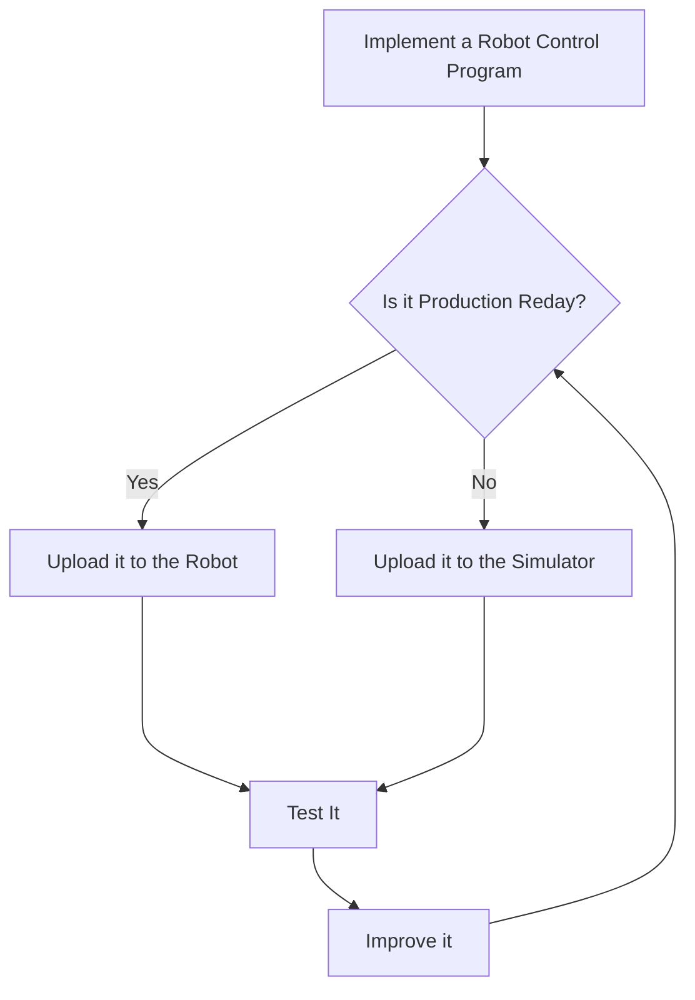

# learning-robotics

## Try Out of Mermaid 

Her you should see the Diagram  drawn with mermaid!

```mermaid
  flowchart TD;
  A[Implement a Robot Control Program] --> B{Is it Production Reday?};
  B -- Yes --> C[Upload it to the Robot];
  B -- No --> D[Upload it to the Simulator]
  C ----> E[Test It];
  D ----> E[Test It] --> F;
  F[Improve it];
  F --> B;
  
```

